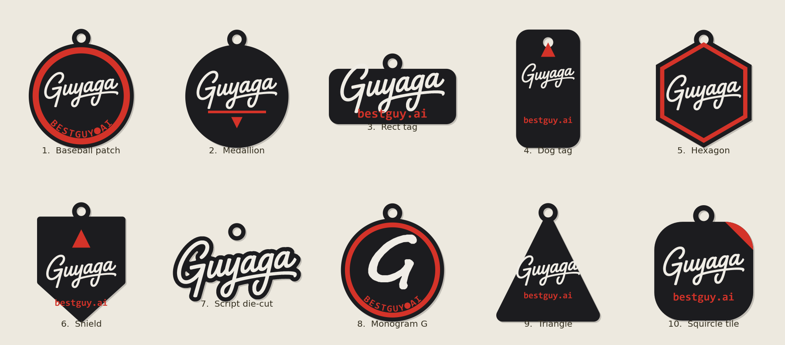
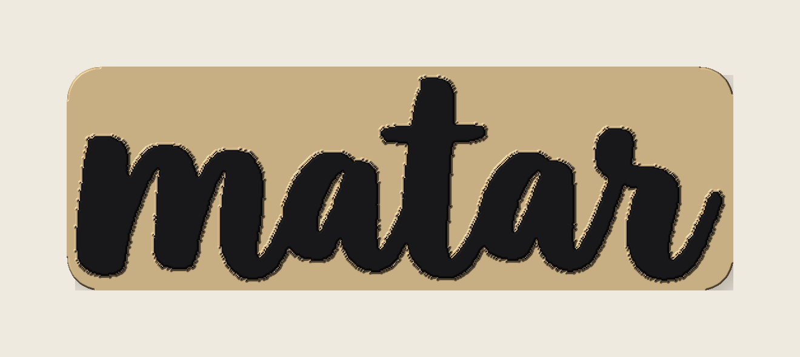
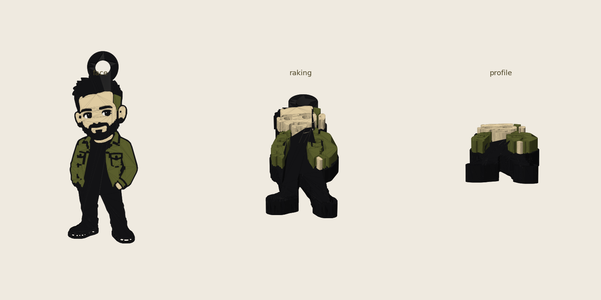

# logo-to-keychain

Turn any **logo, wordmark, or flat cartoon** into a **print-ready, multi-colour keychain** — a watertight `.stl` plus a **Bambu Studio `.3mf`** with each colour already assigned to a filament. A Claude Code skill.



## What it does

- **logo mode** — drops your logo onto a shaped tag and raises it in colour: 9 styles (`baseball`, `circle`, `tag`, `dogtag`, `hexagon`, `shield`, `diecut`, `triangle`, `squircle`), optional tagline, full colour control, integrated keychain loop.
- **mascot mode** — takes a flat 3–4 colour cartoon (e.g. a GPT-Image cartoon of a person/brand character) and builds a **layered colour charm** by segmenting the flat colours.

It uses **direct geometric extrusion** (shapely + trimesh + manifold3d), so designs come out **watertight, flat-backed, and clean to print** — and each colour is a separate part, so Bambu's AMS prints them in the right filament with zero setup. (For *sculptural* 3D objects, use Meshy instead — this is for flat charms/tags.)

## Install

It's a Claude Code skill — drop the folder in your skills directory and invoke `/logo-to-keychain`, or run the engine directly:

```bash
pip install numpy pillow opencv-python shapely trimesh manifold3d mapbox_earcut
```

## Use

```bash
# logo on a baseball-patch tag, brand colours, with an arched tagline
python scripts/keychain.py --mode logo --image logo.png \
  --style baseball --tagline "MYBRAND.COM" \
  --base-color "#141414" --logo-color "#FFFFFF" --accent-color "#E0322B" \
  --width 70 --name mybrand --out ./keychains

# mascot charm from a flat cartoon
python scripts/keychain.py --mode mascot --image cartoon.png \
  --palette "#141414,#5F632F,#EBD6AA,#D43122" --width 70 --name mascot --out ./keychains
```

Each run writes `<name>.stl`, `<name>_color.3mf`, and `<name>_preview.png`.

## Print

Flat, back down, **no supports**. 3 mm base + 2 mm relief by default. Open the `.3mf` in Bambu Studio — colours are pre-assigned to filaments 1/2/3 (base, logo, accent); set your AMS slots to match. Scale freely in the slicer.

## Examples

| Logo charm | Mascot charm |
|---|---|
|  |  |

---

No API keys required. MIT.
